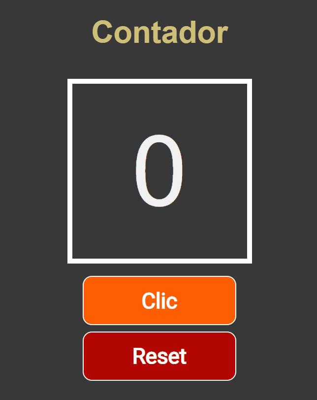

# **Counter** 🧮  
The counter is a project using `React.js` and `Hooks` to manage the status of a functional component, also I'm using `EventListeners` to hear the click event.

I applied some funny `CSS` styles and good practices in my `JavaScript` code and my `HTML` language.

  

You can see more in my [Porfolio](www.luissotoj.com) or Here in my GitHub.

## Have a nice day. And we go on! practicing to code 🔥